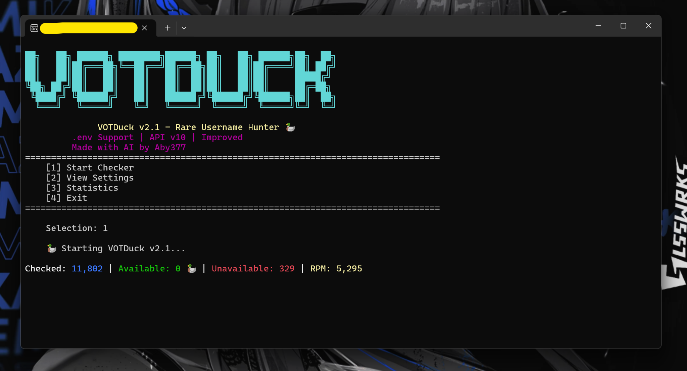

# Discord-Rare-Username-gen
🦆 AI-assisted asynchronous username scanner with live statistics, webhook notifications, and customizable generation settings.

# 🦆 VOTDuck v2.1

> Rare Username Hunter

## 🤖 AI Generated Project

This project was developed with the help of Artificial Intelligence.

- The source code was generated and optimized using AI assistance.
- The project design and implementation were AI-assisted.
- This README file was also generated using AI.
- Final adjustments, testing, and configuration were performed by the project owner.

---

VOTDuck is a fast asynchronous username scanner designed to generate and check short, uncommon username combinations. It features customizable settings, webhook notifications, statistics tracking, and high-performance batch processing.

---
